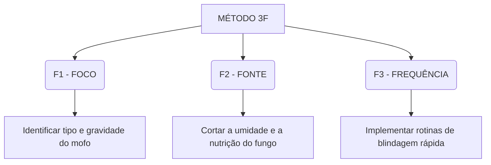

<!-- PAGINA 1 -->
<div style="text-align: center; padding: 100px 0;">
  <p style="font-size: 14px; letter-spacing: 3px; font-weight: bold; color: #ee6352; text-transform: uppercase;">Material Educativo de Apoio Doméstico</p>
  <h1 style="font-size: 54px; margin: 40px 0 10px; line-height: 1.1; color: #3a1b09; font-weight: 950;">GUIA 3F ANTI-MOFO</h1>
  <h2 style="font-size: 22px; margin: 0 0 50px; color: #6d6259; font-weight: 800;">O Método Completo para Blindar sua Casa e Proteger seus Bens contra o Bolor e os Fungos Ocultos</h2>
  
  <div style="margin: 80px 0;">
    <p style="font-size: 16px; color: #363636;"><b>[INSERIR IMAGEM: Mockup 3D ou Ilustração Principal da Capa Mofo Zero]</b></p>
  </div>

  <p style="font-size: 15px; color: #6d6259; margin-top: 100px;">Versão 1.0 • Edição Especial para Clientes</p>
</div>

<div style="page-break-after: always;"></div>

<!-- PAGINA 2 -->
## SUMÁRIO

*   **PÁGINA 3:** INTRODUÇÃO: O Guia SOS do Seu Lar
*   **PÁGINA 4:** COMO CONSULTAR ESTE MATERIAL E OBTER RESULTADOS
*   **PÁGINA 5:** CAPÍTULO 1: O MÉTODO 3F — VISÃO GERAL
*   **PÁGINA 6:** F 1 — FOCO: MAPEAMENTO DE MOFO LEVE A MODERADO
*   **PÁGINA 7:** F 1 — FOCO: IDENTIFICANDO O MOFO PRETO (NÍVEL CRÍTICO)
*   **PÁGINA 8:** F 2 — FONTE: CORTANDO A NUTRIÇÃO E A UMIDADE
*   **PÁGINA 9:** F 2 — FONTE: A DINÂMICA DA CIRCULAÇÃO DO AR E PONTOS FRIOS
*   **PÁGINA 10:** F 3 — FREQUÊNCIA: O ESCUDO PREVENTIVO DE 5 MINUTOS
*   **PÁGINA 11:** CAPÍTULO 2: ELIMINAÇÃO POR SUPERFÍCIE — ROUPAS BRANCAS
*   **PÁGINA 12:** ELIMINAÇÃO POR SUPERFÍCIE — ROUPAS COLORIDAS E SINTÉTICOS
*   **PÁGINA 13:** ELIMINAÇÃO POR SUPERFÍCIE — TECIDOS DELICADOS
*   **PÁGINA 14:** ELIMINAÇÃO POR SUPERFÍCIE — JAQUETAS E BOLSAS DE COURO
*   **PÁGINA 15:** ELIMINAÇÃO POR SUPERFÍCIE — CALÇADOS DE COURO E CAMURÇA
*   **PÁGINA 16:** ELIMINAÇÃO POR SUPERFÍCIE — GAVETAS E GUARDA-ROUPAS (MDF)
*   **PÁGINA 17:** ELIMINAÇÃO POR SUPERFÍCIE — PAREDES E TETOS (GESSO/LAJE)
*   **PÁGINA 18:** ELIMINAÇÃO POR SUPERFÍCIE — REJUNTES E SILICONES DO BANHEIRO
*   **PÁGINA 19:** BÔNUS 1: O GUIA SECRETO POR CÔMODO — O QUARTO
*   **PÁGINA 20:** BÔNUS 1: O GUIA SECRETO POR CÔMODO — O BANHEIRO
*   **PÁGINA 21:** BÔNUS 1: O GUIA SECRETO POR CÔMODO — A COZINHA E DESPENSA
*   **PÁGINA 22:** BÔNUS 1: O GUIA SECRETO POR CÔMODO — LAVANDERIA E ÁREA DE SERVIÇO
*   **PÁGINA 23:** BÔNUS 2: A TABELA PRODUTO VS SUPERFÍCIE (PARTE 1)
*   **PÁGINA 24:** BÔNUS 2: A TABELA PRODUTO VS SUPERFÍCIE (PARTE 2)
*   **PÁGINA 25:** BÔNUS 3: PLANO DE CHOQUE DE 7 DIAS — DIAS 1 E 2
*   **PÁGINA 26:** BÔNUS 3: PLANO DE CHOQUE DE 7 DIAS — DIAS 3 E 4
*   **PÁGINA 27:** BÔNUS 3: PLANO DE CHOQUE DE 7 DIAS — DIAS 5 E 6
*   **PÁGINA 28:** BÔNUS 3: PLANO DE CHOQUE DE 7 DIAS — DIA 7
*   **PÁGINA 29:** BÔNUS 4: LISTA INTELIGENTE DE COMPRAS — ATIVOS E EPIS
*   **PÁGINA 30:** BÔNUS 4: LISTA INTELIGENTE DE COMPRAS — PREVENTIVOS CASEIROS
*   **PÁGINA 31:** CONCLUSÃO, NORMAS DE SEGURANÇA E ISENÇÃO DE RESPONSABILIDADE

<div style="page-break-after: always;"></div>

<!-- PAGINA 3 -->
## INTRODUÇÃO
### O Guia SOS do Seu Lar

Se você abriu este manual, é muito provável que esteja travando uma batalha exaustiva contra um inimigo silencioso que teima em retornar toda semana. Você limpa, esfrega, gasta pequenas fortunas com produtos químicos caros do supermercado e, em poucos dias, lá estão eles novamente: as manchas escuras no teto do banheiro, o cheiro sufocante de guardado nas roupas limpas ou aquele calçado de couro caríssimo coberto por uma fina penugem esbranquiçada.

Pior do que o prejuízo material de ter que jogar roupas e bolsas no lixo é o impacto invisível que esse microclima causa na saúde respiratória da sua família. Os fungos liberam esporos microscópicos no ar 24 horas por dia. Quando inalados, esses esporos agem como gatilhos brutais para crises de rinite alérgica, asma, garganta inflamada, coceira nos olhos e tosses persistentes noturnas.

Este material foi construído para ser o seu **remédio caseiro imediato**. Nós eliminamos toda a teoria biológica desnecessária e focamos exclusivamente no que funciona. A partir de hoje, você aprenderá a agir como um profissional, desinfetando superfícies com precisão e blindando sua casa para que o mofo nunca encontre condições de retornar.

<div style="margin: 30px 0; text-align: center;">
  <p style="font-size: 15px; color: #6d6259;"><b>[INSERIR IMAGEM: Foto demonstrando o contraste de um ambiente mofado (escuro, úmido) versus um ambiente limpo e saudável (arejado, ensolarado)]</b></p>
</div>

<div style="page-break-after: always;"></div>

<!-- PAGINA 4 -->
## COMO CONSULTAR ESTE MATERIAL E OBTER RESULTADOS

Este guia foi desenhado para ser uma ferramenta de consulta rápida. Você não precisa ler o e-book do início ao fim de uma só vez para começar a ver os resultados. Em vez disso, siga o fluxo de ação simplificado:

1.  **Mapeie o Foco:** Se você acabou de se deparar com uma mancha ou odor de mofo, vá direto ao **Capítulo 1 (Páginas 5 a 10)** para diagnosticar que tipo de infestação você possui.
2.  **Identifique a Superfície:** Vá para o **Capítulo 2 (Páginas 11 a 18)** e encontre o material exato que você precisa limpar (MDF, tecidos, couro, paredes). Siga o passo a passo de receitas e aplicações recomendado.
3.  **Consulte a Tabela de Compatibilidade:** Antes de aplicar qualquer produto em um item valioso, consulte a **Tabela Produto vs Superfície (Páginas 23 e 24)** para garantir que você não desbotará ou danificará o material.
4.  **Execute o Plano de Choque:** Se o problema estiver espalhado por vários cômodos, utilize o cronograma de 30 minutos diários detalhado no **Plano de Choque de 7 Dias (Páginas 25 a 28)**.

> [!NOTE]
> Mantenha este arquivo salvo no seu celular. Sempre que vir um sinal de bolor ou sentir o cheiro característico de umidade ao abrir uma gaveta, abra o manual e aplique a solução imediatamente. A rapidez é o fator decisivo para salvar seus pertences.

<div style="page-break-after: always;"></div>

<!-- PAGINA 5 -->
## CAPÍTULO 1: O MÉTODO 3F — VISÃO GERAL

Para erradicar o mofo definitivamente, você precisa parar de agir no improviso. Limpar apenas a mancha visível que aparece na superfície equivale a cortar as folhas de uma erva daninha deixando a raiz viva debaixo da terra: em poucos dias ela crescerá novamente. 

O método **3F** consiste em três pilares integrados de limpeza e manutenção preventiva:



*   **FOCO:** Mapear o tipo de mofo e sua coloração para agir com o produto químico correto sem estragar o material afetado.
*   **FONTE:** Interromper o microclima que alimenta o fungo (estagnação de ar, escuridão e umidade condensada).
*   **FREQUÊNCIA:** Rotinas rápidas que quebram o ciclo reprodutivo dos esporos antes que eles consigam se fixar novamente.

Nas próximas páginas, veremos detalhadamente como aplicar cada um desses conceitos na prática do seu dia a dia.

<div style="page-break-after: always;"></div>

<!-- PAGINA 6 -->
## F 1 — FOCO: MAPEAMENTO DE MOFO LEVE A MODERADO

O primeiro passo para a solução é saber exatamente com quem você está lidando. Os fungos domésticos se apresentam em diferentes colorações e texturas de acordo com a umidade e o tempo de proliferação:

### 1. Mofo Branco (Foco Leve)
Apresenta-se como uma penugem esbranquiçada e fina, quase como teias de aranha microscópicas. É o estágio inicial da infestação, alimentando-se de poeira superficial, fiapos de tecidos ou resíduos celulares (como pele morta em casacos guardados). 
*   **Gravidade:** Baixa.
*   **Risco:** Se espalha com extrema facilidade pelo ar a qualquer sopro de vento.
*   **Cuidado:** Nunca limpe espanando ou com escova seca. Isso espalhará os esporos. Sempre umedeça a superfície antes de remover.

### 2. Bolor Verde-Escuro ou Cinza (Foco Moderado)
Fungos de coloração esverdeada ou acinzentada que crescem em ambientes com umidade constante e escuridão média. É comum em gavetas de guarda-roupas de MDF, fundos de armários de cozinha e solados de sapatos guardados logo após o uso.
*   **Gravidade:** Média.
*   **Risco:** Causa forte odor de guardado e começa a degradar o material em que está instalado.

<div style="margin: 20px 0; text-align: center;">
  <p style="font-size: 15px; color: #6d6259;"><b>[INSERIR IMAGEM: close-up macro mostrando o mofo branco em penugem sobre tecido e o bolor verde-escuro em placa no MDF de um armário]</b></p>
</div>

<div style="page-break-after: always;"></div>

<!-- PAGINA 7 -->
## F 1 — FOCO: IDENTIFICANDO O MOFO PRETO (NÍVEL CRÍTICO)

O mofo preto representa o nível mais avançado e perigoso de contaminação fúngica fétida em uma residência.

### 3. Mofo Preto (Foco Severo / Crítico)
Apresenta-se como manchas circulares escuras e concêntricas, por vezes ásperas ou com aspecto aveludado e úmido. Costuma se fixar em superfícies porosas como teto de banheiro sobre o chuveiro, paredes com infiltração, drywall e gesso.
*   **Gravidade:** Alta.
*   **Risco à Saúde:** Os fungos pretos (como o *Stachybotrys chartarum*) liberam toxinas microscópicas muito agressivas (micotoxinas). A inalação frequente pode causar dores de cabeça crônicas, cansaço inexplicável, hemorragias nasais e crises de bronquite graves.
*   **Risco Estrutural:** O mofo preto consome a celulose e a umidade de painéis de gesso e MDF, podendo apodrecer e esfarelar a estrutura interna de móveis e paredes.

> [!WARNING]
> Ao limpar focos de mofo preto, use sempre luvas de borracha grossas e máscara respiratória PFF2 (ou N95). A liberação maciça de esporos durante a limpeza pode provocar reações alérgicas violentas se feita sem proteção.

<div style="margin: 20px 0; text-align: center;">
  <p style="font-size: 15px; color: #6d6259;"><b>[INSERIR IMAGEM: Foto demonstrando o uso correto de EPIs (luva e máscara) durante a limpeza de uma parede com manchas escuras de mofo preto]</b></p>
</div>

<div style="page-break-after: always;"></div>

<!-- PAGINA 8 -->
## F 2 — FONTE: CORTANDO A NUTRIÇÃO E A UMIDADE

Os fungos não conseguem sobreviver sem três fatores essenciais: **água** (umidade líquida ou vapor de água), **escuridão** e **matéria orgânica** (alimento). Para matar o mofo pela raiz, precisamos cortar a fonte dessas três variáveis.

### Como diagnosticar a origem da umidade:
*   **Infiltração Ativa:** Manchas de umidade que começam de dentro para fora da parede, descascando o reboco e formando bolhas na pintura. O mofo é persistente e se concentra em um ponto específico de forma circular.
    *   *Solução:* É necessário consertar o vazamento de cano ou fazer impermeabilização externa. Nenhuma receita química resolverá permanentemente enquanto houver infiltração ativa de água.
*   **Condensação Superficial:** Manchas de mofo que aparecem de forma pulverizada no teto, nos rejuntes do banheiro ou atrás de móveis encostados na parede. A parede por dentro está seca, mas o ar úmido do ambiente condensa em contato com superfícies frias.
    *   *Solução:* Cortar a umidade do ar melhorando a ventilação e eliminando os pontos de condensação fúngica fáceis.

```
+-----------------------------------+-----------------------------------+
|       INFILTRAÇÃO ATIVA           |      CONDENSAÇÃO SUPERFICIAL      |
+-----------------------------------+-----------------------------------+
| - Descasca reboco de dentro fora  | - Manchas pretas pulverizadas     |
| - Concentrada em ponto circular   | - Ocorre em cantos e tetos        |
| - Cano quebrado / laje vazando    | - Falta de ventilação / ar úmido  |
+-----------------------------------+-----------------------------------+
```

<div style="page-break-after: always;"></div>

<!-- PAGINA 9 -->
## F 2 — FONTE: A DINÂMICA DA CIRCULAÇÃO DO AR E PONTOS FRIOS

Muitas vezes, a fonte do mofo é criada de forma imperceptível por nós ao posicionarmos os móveis incorretamente dentro dos cômodos da casa.

### O Efeito "Parede Fria"
As paredes externas de uma casa (aquelas que recebem chuva e vento do lado de fora) são muito mais frias do que o ar aquecido no interior dos quartos. 
Se você encosta um guarda-roupa ou uma cabeceira de cama diretamente nessa parede fria:
1.  Você impede o ar quente do quarto de circular naquele espaço estreito.
2.  A umidade invisível suspensa no ar condensa atrás do móvel devido ao choque térmico, criando uma fina película de água microscópica.
3.  O fungo encontra o alimento ideal (a cola e a celulose da traseira do MDF) aliado à água condensada e à escuridão perfeita.

> [!IMPORTANT]
> Afaste todos os seus guarda-roupas, cômodas e cabeceiras de cama em pelo menos **5 centímetros** das paredes externas. Essa simples folga permite que o ar circule livremente por trás dos móveis, secando a umidade por evaporação natural e quebrando a fonte reprodutiva do fungo.

<div style="margin: 30px 0; text-align: center;">
  <p style="font-size: 15px; color: #6d6259;"><b>[INSERIR DIAGRAMA: Ilustração mostrando o fluxo de ar passando por trás de um armário afastado 5cm da parede fria versus o bloqueio e a condensação gerados quando o armário está totalmente encostado]</b></p>
</div>

<div style="page-break-after: always;"></div>

<!-- PAGINA 10 -->
## F 3 — FREQUÊNCIA: O ESCUDO PREVENTIVO DE 5 MINUTOS

O terceiro pilar do Método 3F baseia-se no ciclo reprodutivo do fungo. Um esporo de mofo que pousa em uma gaveta precisa de 24 a 48 horas sob condições calmas, úmidas e escuras para germinar suas hifas (raízes) e se fixar de forma definitiva.

Se você romper essa estabilidade antes que o prazo expire, o fungo morre antes de crescer. É o que chamamos de **Escudo Preventivo**:

*   **A Rotina de Ventilação Forçada (5 Minutos):** Uma vez por semana, abra todas as portas do seu guarda-roupa e gavetas. Ligue um ventilador na velocidade máxima apontado diretamente para dentro do armário por 5 a 10 minutos. Isso remove o bolsão de ar úmido estagnado.
*   **O Efeito Solar Direto:** A radiação ultravioleta (UV) natural do sol é um esterilizador de esporos altamente potente. Abra as cortinas e deixe a luz solar entrar no quarto nos períodos da manhã.
*   **Monitoramento de Umidade Físico:** Troque o ar estagnado de armários em dias de sol e mantenha as portas fechadas em dias de chuva torrencial (quando a umidade externa está em 90%).

Com a aplicação contínua desses hábitos simples, a necessidade de limpezas profundas desgastantes cairá drasticamente.

<div style="page-break-after: always;"></div>

<!-- PAGINA 11 -->
## CAPÍTULO 2: ELIMINAÇÃO POR SUPERFÍCIE — ROUPAS BRANCAS

Roupas brancas de tecidos resistentes (algodão ou linho) toleram agentes clareadores e de pH mais elevado. Para remover o mofo de forma definitiva sem danificar a integridade das fibras:

### Receita de Cloro Ativo com Açúcar (Técnica SOS)
O açúcar atua como um agente suavizante químico natural, reduzindo o desgaste corrosivo do cloro sobre o tecido de algodão e prevenindo o amarelamento permanente das roupas brancas.
*   **Ingredientes:** 1 litro de água morna, 1 xícara de açúcar refinado e 1 xícara de água sanitária (cloro ativo).
*   **Passo a Passo:**
    1. Misture o açúcar e a água sanitária na água morna até dissolver por completo.
    2. Submerja apenas a área mofada da roupa na bacia por 15 a 30 minutos.
    3. Monitore visualmente a mancha clarear. Assim que desaparecer, retire a peça.
    4. Enxágue abundantemente em água corrente fria e lave com sabão neutro.

### Método Alternativo com Peróxido de Hidrogênio (Sem Cloro)
*   **Ingredientes:** Água Oxigenada 10 Volumes pura.
*   **Passo a Passo:** Aplique a água oxigenada diretamente sobre o foco de mofo. Deixe agir por 15 minutos até espumar. Esfregue levemente com escova macia e lave.

<div style="margin: 20px 0; text-align: center;">
  <p style="font-size: 15px; color: #6d6259;"><b>[INSERIR IMAGEM: Sequência de fotos (Antes, Durante a imersão na bacia, e Depois) da remoção de mofo de uma blusa branca de algodão]</b></p>
</div>

<div style="page-break-after: always;"></div>

<!-- PAGINA 12 -->
## ELIMINAÇÃO POR SUPERFÍCIE — ROUPAS COLORIDAS E SINTÉTICOS

Roupas coloridas e tecidos sintéticos (nylon, poliéster, elastano) exigem métodos delicados. O cloro comum destruirá a tintura do tecido, gerando desbotamento instantâneo.

### Receita Fungicida com Vinagre e Bicarbonato (Etapas Separadas)
> [!WARNING]
> Nunca misture vinagre e bicarbonato de sódio juntos no mesmo balde para guardar. A reação química de efervescência anula o efeito ácido de um e alcalino de outro, sobrando apenas água com sal. Use-os em etapas sequenciais separadas!
*   **Ingredientes:** Vinagre de Álcool Branco puro, Bicarbonato de Sódio e água morna.
*   **Passo a Passo:**
    1. **Etapa Ácida (Matar o Fungo):** Despeje Vinagre de Álcool Branco puro sobre a mancha de mofo até saturar o tecido. Deixe agir por 20 a 30 minutos para desinfetar.
    2. **Enxágue:** Lave a área com água limpa para remover o excesso de vinagre.
    3. **Etapa Alcalina (Remover a Mancha):** Faça uma pasta grossa misturando 2 colheres de sopa de bicarbonato de sódio com algumas gotas de água morna. Aplique sobre a mancha residual de mofo e esfregue delicadamente com escova macia.
    4. Deixe agir por 15 minutos e lave a peça normalmente na máquina de lavar.

<div style="page-break-after: always;"></div>

<!-- PAGINA 13 -->
## ELIMINAÇÃO POR SUPERFÍCIE — TECIDOS DELICADOS

Materiais finos como seda, lã pura e linho cru possuem fibras proteicas extremamente sensíveis que se dissolvem ou se rompem se forem expostas a ácidos fortes, cloro ou atrito excessivo.

### Método de Imersão em Leite (Para Manchas Leves)
O ácido lático presente no leite morno atua como um agente clareador suave e seguro que solta a mancha de mofo das fibras proteicas finas sem danificar a cor ou a textura do tecido delicado.
*   **Ingredientes:** Leite integral morno suficiente para cobrir a mancha.
*   **Passo a Passo:**
    1. Aqueça o leite até ficar morno (não deixe ferver).
    2. Coloque a peça de seda ou lã de forma que a mancha de mofo fique submersa no leite.
    3. Deixe de molho por 2 a 3 horas, verificando periodicamente.
    4. Assim que a mancha se soltar, retire a roupa, enxágue com água morna e lave à mão com sabão específico para tecidos delicados (como sabão de coco neutro).

### Método Fungicida com Álcool Isopropílico (Para Casacos de Lã Grossos)
*   **Ingredientes:** Álcool Isopropílico (ou Álcool 70% líquido).
*   **Passo a Passo:** Umedeça levemente uma mecha de algodão limpa no álcool. Pressione suavemente sobre as manchas de bolor em batidas repetidas. Deixe secar naturalmente à sombra.

<div style="page-break-after: always;"></div>

<!-- PAGINA 14 -->
## ELIMINAÇÃO POR SUPERFÍCIE — JAQUETAS E BOLSAS DE COURO

O couro legítimo é uma pele orgânica tratada. Ele é poroso e absorve óleos naturais. Os fungos adoram se fixar no couro porque se alimentam dessas fibras orgânicas sob umidade. Nunca use sabão em pó ou cloro no couro.

### Método de Limpeza e Revitalização do Couro
*   **Ingredientes:** Álcool Isopropílico (ou Álcool Etílico 70% líquido), panos de microfibra limpos e Óleo de Amêndoas puro (ou hidratante específico para couros).
*   **Passo a Passo:**
    1. **Extração Física:** Leve o casaco ou bolsa de couro para fora de casa (área aberta) para evitar espalhar esporos. Use máscara.
    2. **Desinfecção Superficial:** Umedeça levemente um pano de microfibra com o álcool. **O pano deve estar apenas úmido, nunca encharcado.** Esfregue toda a peça de couro uniformemente, removendo toda a poeira e penugem branca fúngica.
    3. **Secagem:** Deixe a peça secar em local com vento e sombra por 4 horas. Não use secador e evite sol forte para não enrugar o couro.
    4. **Nutrição e Proteção:** Com o couro seco, aplique 3 a 4 gotas de óleo de amêndoas em um pano seco e massageie suavemente toda a superfície. Isso nutre o couro, amacia e cria uma camada lipídica protetora que impede o esporo de se fixar.

<div style="margin: 20px 0; text-align: center;">
  <p style="font-size: 15px; color: #6d6259;"><b>[INSERIR IMAGEM: Foto exibindo a aplicação do hidratante/óleo de amêndoas em movimentos circulares sobre uma jaqueta de couro limpa]</b></p>
</div>

<div style="page-break-after: always;"></div>

<!-- PAGINA 15 -->
## ELIMINAÇÃO POR SUPERFÍCIE — CALÇADOS DE COURO E CAMURÇA

Sapatos de camurça e nobuck possuem uma textura de fibras abertas (pelugem) extremamente difícil de limpar se o mofo penetrar profundamente.

### Limpeza de Sapatos e Botas de Camurça
*   **Ingredientes:** Condicionador de cabelos diluído em água morna, vinagre de álcool branco, escova de cerdas de nylon (ou cerdas de latão específicas para camurça).
*   **Passo a Passo:**
    1. **Remoção Inicial:** Use uma escova seca de dentes limpa para escovar o sapato mofado, sempre na mesma direção dos pelos, para remover o excesso de penugem (faça isso em área aberta e com máscara).
    2. **Ação Fungicida:** Umedeça levemente um pano macio em Vinagre de Álcool misturado com água (proporção 1:1) e dê batidas leves sobre a camurça afetada. Deixe secar à sombra.
    3. **Restauração da Textura:** Para evitar que o vinagre endureça o pelo da camurça, faça uma mistura de 1 colher de chá de condicionador de cabelo para 1 copo de água morna. Aplique levemente com um pano úmido por todo o sapato.
    4. Deixe secar completamente por 12 horas.
    5. Escove o sapato com a escova de camurça para levantar os pelos e devolver o toque macio original.

<div style="page-break-after: always;"></div>

<!-- PAGINA 16 -->
## ELIMINAÇÃO POR SUPERFÍCIE — GAVETAS E GUARDA-ROUPAS (MDF)

Os guarda-roupas modernos feitos de MDF ou MDP (madeiras aglomeradas com cola) absorvem umidade com extrema facilidade por cantos não lacrados ou furos de parafusos.

### Mistura Fungicida com Óleo de Melaleuca (Tea Tree)
O óleo essencial de melaleuca possui fortes propriedades fungicidas que não evaporam instantaneamente como o álcool, criando um efeito protetor residual que dura semanas nas gavetas.
*   **Ingredientes:** 250ml de Vinagre de Álcool Branco, 100ml de água destilada, 15 gotas de Óleo Essencial de Melaleuca puro e borrifador.
*   **Passo a Passo:**
    1. Misture todos os ingredientes no borrifador e chacoalhe bem antes de usar.
    2. **Importante:** Nunca borrife a mistura diretamente sobre o MDF cru ou nas juntas dos móveis (isso pode causar inchaço da madeira). Borrife a solução em um pano de microfibra limpo.
    3. Esfregue o pano umedecido em todas as prateleiras internas, teto do guarda-roupa, gavetas (laterais e fundo) e trilhos das portas.
    4. Mantenha o móvel totalmente aberto por pelo menos 4 a 6 horas com um ventilador ligado apontado para as portas para garantir que a umidade da limpeza se evapore por completo antes de repor as roupas.

<div style="page-break-after: always;"></div>

<!-- PAGINA 17 -->
## ELIMINAÇÃO POR SUPERFÍCIE — PAREDES E TETOS (GESSO/LAJE)

O teto de banheiros e paredes de quartos voltadas para áreas úmidas frequentemente desenvolvem colônias escuras de mofo preto, as quais soltam poeira de esporos altamente tóxica.

### Remoção Segura de Mofo Preto de Paredes
*   **Ingredientes:** Máscara facial, luvas descartáveis de borracha, óculos protetores, Água Sanitária (cloro ativo) e água morna.
*   **Passo a Passo:**
    1. **Preparação:** Equipe os itens de proteção individual. Abra as janelas do cômodo.
    2. **Diluição:** Em um balde ou borrifador grande, misture 1 parte de água sanitária para 2 partes de água.
    3. **Aplicação Controlada:** Molhe uma esponja na solução e pressione-a diretamente sobre as manchas de mofo preto na parede ou no teto. **Evite esfregar vigorosamente**, o que espalha as partículas no ar e remove a tinta da parede. Deixe a esponja úmida em contato com o bolor.
    4. **Tempo de Ação:** Deixe a solução agir de 20 a 30 minutos. As manchas pretas começarão a sumir gradativamente.
    5. **Remoção de Resíduos:** Passe um pano limpo umedecido apenas em água limpa para remover o cloro residual e a sujeira desprendida. Deixe secar intensamente antes de encostar qualquer objeto na parede.

<div style="page-break-after: always;"></div>

<!-- PAGINA 18 -->
## ELIMINAÇÃO POR SUPERFÍCIE — REJUNTES E SILICONES DO BANHEIRO

Os rejuntes de azulejos e os silicones de vedação da banheira ou do box do chuveiro acumulam restos de sabonete e gordura corporal, servindo de alimento perfeito para fungos sob a umidade constante do banheiro.

### Técnica da Pasta de Cloro Adesiva
O cloro líquido comum escorre rapidamente pelas paredes verticais antes de conseguir eliminar o fungo profundo nos rejuntes. Esta receita resolve isso criando uma pasta que fixa no rejunte.
*   **Ingredientes:** 3 colheres de sopa de Bicarbonato de Sódio, 1 colher de sopa de água sanitária concentrada e 1 colher de chá de detergente líquido neutro.
*   **Passo a Passo:**
    1. Misture os ingredientes em um pote plástico até formar uma pasta consistente (semelhante a creme dental).
    2. Aplique a pasta diretamente nas linhas pretas do rejunte ou no silicone usando uma espátula plástica ou escova velha.
    3. Deixe agir por **45 minutos**.
    4. Esfregue levemente o rejunte com uma escova de cerdas de nylon duras.
    5. Enxágue abundantemente com o próprio chuveiro (água morna). O rejunte voltará à cor clara original.

<div style="margin: 20px 0; text-align: center;">
  <p style="font-size: 15px; color: #6d6259;"><b>[INSERIR IMAGEM: Foto demonstrando a aplicação da pasta de bicarbonato com cloro cobrindo os rejuntes do banheiro e o resultado limpo após enxágue]</b></p>
</div>

<div style="page-break-after: always;"></div>

<!-- PAGINA 19 -->
## BÔNUS 1: O GUIA SECRETO POR CÔMODO — O QUARTO

No quarto, o mofo atua diretamente sobre o nosso organismo no momento em que estamos mais vulneráveis: durante as longas horas de sono.

### Checklist Prático para o Quarto:
*   [ ] **Cabeceira e Cama Box:** Afaste a cabeceira e a cama box em 5 cm da parede fria que dá para o exterior. Aspire a traseira do móvel uma vez por mês.
*   [ ] **Rotatividade do Colchão:** A cada 30 dias, rotacione o colchão (mude a extremidade dos pés para a cabeceira e vire a face superior para baixo). Isso distribui a umidade natural do corpo que se acumula no colchão.
*   [ ] **Arejamento Diário:** Nunca arrume a cama logo após acordar. Deixe o lençol dobrado no pé da cama e mantenha o colchão exposto ao ar com a janela do quarto aberta por pelo menos 30 minutos antes de esticar as cobertas.
*   [ ] **Organização Interna do Guarda-Roupa:** Não guarde roupas úmidas ou suadas de uso rápido de volta nas gavetas. Deixe-as arejar em cabideiros externos antes de guardar. Evite usar caixas de papelão organizadoras (que atraem umidade); dê preferência a organizadores de TNT ou plástico aramado.

<div style="page-break-after: always;"></div>

<!-- PAGINA 20 -->
## BÔNUS 1: O GUIA SECRETO POR CÔMODO — O BANHEIRO

O banheiro acumula umidade extrema diariamente devido ao vapor gerado durante banhos quentes. Sem uma rotina preventiva, o teto desenvolverá bolor preto rapidamente.

### Checklist Prático para o Banheiro:
*   [ ] **Ventilação Ativa (Pós-Banho):** Mantenha a janela do banheiro aberta em pelo menos 15 cm durante e após o banho. Deixe a porta do banheiro aberta nos 30 minutos seguintes para dispersar o bolsão de umidade.
*   [ ] **Drenagem de Tapetes:** Retire o tapete de tecido do chão do banheiro logo após o término dos banhos do dia e pendure-o no varal. Tapetes úmidos deitados no chão frio viram berçários ideais de fungos e bactérias causadoras de mau odor nos pés.
*   [ ] **Cortinas e Vedações do Box:** Puxe a cortina de plástico do box totalmente para que ela estique e seque as dobras após o banho. Acúmulos de água nas dobras plásticas geram a clássica faixa preta de bolor.
*   [ ] **Borrachas e Silicones da Pia:** Seque os cantos da pia com um rodinho de pia portátil após o uso. A água parada acumulada ao redor das torneiras estraga o acabamento e cria mofo nas vedações.

<div style="page-break-after: always;"></div>

<!-- PAGINA 21 -->
## BÔNUS 1: O GUIA SECRETO POR CÔMODO — A COZINHA E DESPENSA

Na cozinha, o risco do mofo reside principalmente na contaminação direta de alimentos armazenados e na degradação de utensílios de madeira.

### Checklist Prático para a Cozinha:
*   [ ] **Desinfecção do Armário da Pia:** Retire mensalmente os itens de limpeza guardados sob a pia. Verifique vazamentos nas roscas do sifão e borrife vinagre de álcool nas paredes para esterilização de esporos.
*   [ ] **Borrachas de Vedação da Geladeira:** Limpe as borrachas da geladeira a cada 15 dias com vinagre. O abre e fecha constante puxa o ar quente e úmido da cozinha que condensa na borracha fria da porta da geladeira.
*   [ ] **Utensílios de Madeira e Bambu:** Nunca guarde colheres de pau, tábuas de corte ou organizadores de bambu úmidos dentro de gavetas fechadas. Seque-os completamente ao sol ou em local arejado antes de guardar. Utensílios de bambu guardados molhados mofam em menos de 48 horas.
*   [ ] **Fruteira e Alimentos Frescos:** Vistorie a fruteira diariamente. Remova qualquer fruta que comece a melar ou apresentar penugem cinza. Um único alimento estragado solta milhões de esporos que aceleram a decomposição das outras frutas ao redor.

<div style="page-break-after: always;"></div>

<!-- PAGINA 22 -->
## BÔNUS 1: O GUIA SECRETO POR CÔMODO — LAVANDERIA E ÁREA DE SERVIÇO

A lavanderia abriga equipamentos que trabalham diretamente com água sanitária e roupas sujas, exigindo rotinas de autolimpeza periódicas.

### Checklist Prático para a Lavanderia:
*   [ ] **Autolimpeza da Máquina de Lavar:** A cada 30 dias, rode um ciclo completo de lavagem na máquina (nível alto de água, ciclo mais longo) sem roupas, adicionando **1 litro de Água Sanitária** diretamente no tambor. Isso limpa a tubulação interna e remove resíduos fúngicos acumulados de sabão.
*   [ ] **Abertura da Porta da Máquina:** Mantenha a tampa (ou porta frontal) da máquina de lavar entreaberta sempre que o equipamento não estiver em funcionamento para evitar o cheiro de água choca interno.
*   [ ] **Gestão do Varal Interno:** Se você seca roupas em varal de teto ou de chão dentro do apartamento/casa, garanta que o varal fique posicionado ao lado de uma janela aberta. Secar roupas em cômodo fechado lança cerca de 2 litros de água evaporada no ar, que condensará nas paredes frias da casa.

<div style="page-break-after: always;"></div>

<!-- PAGINA 23 -->
## BÔNUS 2: A TABELA PRODUTO VS SUPERFÍCIE (PARTE 1)

Consulte esta tabela antes de iniciar qualquer limpeza profunda para evitar danos químicos acidentais nas superfícies da sua casa.

| Produto | Superfícies Seguras | Superfícies Proibidas | Dosagem Correta | Tempo de Ação |
| :--- | :--- | :--- | :--- | :--- |
| **Álcool 70%** (Isopropílico ou Etílico) | Couro liso envernizado, MDF selado, plásticos, vidros, fórmicas de armários, trincos, solados de calçados. | Tecidos muito delicados (seda, lã) que mancham facilmente, plásticos acrílicos transparentes (podem rachar). | Puro em pano de microfibra limpo (pano apenas úmido). | Deixar secar naturalmente ao ar (3-5 minutos). |
| **Vinagre de Álcool Branco** (Ácido Acético 4-6%) | Tecidos de algodão colorido, paredes pintadas, MDF interno de guarda-roupas, borrachas de geladeiras, rejuntes. | Mármore, granito e pedras calcárias (ácido mancha a pedra), metais ferrosos (causa oxidação/ferrugem rápida). | Puro para focos moderados; Diluído (1 parte de vinagre para 1 de água) para uso preventivo. | 15 a 20 minutos (enxaguar em seguida se aplicado em tecidos). |
| **Água Oxigenada** (Peróxido de Hidrogênio 10 Vol.) | Roupas brancas, tecidos de algodão, gesso cartonado, drywall, teto pintado de branco, azulejos claros. | Tecidos muito coloridos (risco leve de desbotar fibras sensíveis), peças metálicas sem pintura. | Puro (borrifar diretamente na mancha de mofo até espumar). | 10 a 15 minutos até cessar a efervescência ativa. |

<div style="page-break-after: always;"></div>

<!-- PAGINA 24 -->
## BÔNUS 2: A TABELA PRODUTO VS SUPERFÍCIE (PARTE 2)

| Produto | Superfícies Seguras | Superfícies Proibidas | Dosagem Correta | Tempo de Ação |
| :--- | :--- | :--- | :--- | :--- |
| **Água Sanitária / Cloro** (Hipoclorito de Sódio) | Rejuntes de banheiros, azulejos vitrificados, pisos cerâmicos, paredes de alvenaria externas resistentes. | Madeira, MDF, MDP, couro natural, tecidos coloridos, metais (altamente corrosivo para dobradiças). | 1 parte de água sanitária para 2 partes de água limpa; Ou em pasta misturada com bicarbonato. | 20 a 30 minutos (enxaguar ou passar pano úmido em seguida). |
| **Óleo Essencial de Melaleuca** (Tea Tree) | Gavetas de madeira, prateleiras internas de closets, solado interno de sapatos, fundo de armários MDF. | Não há contraindicações de superfícies quando diluído em álcool ou vinagre de álcool. | 10 a 15 gotas diluídas em 200ml de Vinagre de Álcool ou Álcool 70% líquido. | Ação residual contínua (não enxaguar para manter o efeito ativo). |

> [!TIP]
> Em caso de dúvida sobre um tecido ou material específico, aplique uma gota mínima da solução de limpeza em uma área escondida (como a parte interna da barra da calça ou o fundo interno da gaveta). Aguarde 10 minutos para verificar se haverá reação de desbotamento ou ressecamento antes de aplicar no móvel/peça por inteiro.

<div style="page-break-after: always;"></div>

<!-- PAGINA 25 -->
## BÔNUS 3: PLANO DE CHOQUE DE 7 DIAS — DIAS 1 E 2

Este plano de choque foi projetado para livrar sua casa do mofo acumulado rapidamente, dividindo as tarefas em sessões de no máximo 30 minutos diários.

### DIA 1: Auditoria Geral e Diagnóstico
*   **Tempo Estimado:** 20 minutos.
*   **Tarefas do Dia:**
    1. Pegue uma lanterna e vistorie a traseira dos guarda-roupas, debaixo das pias, o teto do banheiro e embaixo dos colchões.
    2. Liste em um papel todos os pontos de contaminação ativa encontrados.
    3. Separe os materiais de limpeza necessários utilizando a **Lista de Compras (Páginas 29 e 30)**.

### DIA 2: Purificação e Tratamento de Ar
*   **Tempo Estimado:** 15 minutos de ação (2 horas de secagem passiva).
*   **Tarefas do Dia:**
    1. Abra todas as janelas da casa para criar correnteza de ar cruzada.
    2. Retire travesseiros, almofadas e cobertores limpos e coloque-os ao sol por 2 horas.
    3. Se possuir ar-condicionado, ligue-o na função "Dry" (Desumidificar) nos cômodos úmidos por 2 horas com as portas fechadas.

<div style="page-break-after: always;"></div>

<!-- PAGINA 26 -->
## BÔNUS 3: PLANO DE CHOQUE DE 7 DIAS — DIAS 3 E 4

Foco no resgate do guarda-roupa e desinfecção de todas as roupas acumuladas no closet.

### DIA 3: Esvaziamento e Desinfecção do Guarda-Roupa
*   **Tempo Estimado:** 30 minutos.
*   **Tarefas do Dia:**
    1. Retire todas as roupas do armário afetado pelo cheiro ou manchas de mofo.
    2. Aspire a poeira das gavetas e prateleiras.
    3. Borrife a **solução fungicida de Vinagre com Melaleuca** em um pano de microfibra e limpe todas as paredes de madeira por dentro.
    4. Deixe o armário aberto com um ventilador ligado apontado para o seu interior por 4 horas para secar.

### DIA 4: Lavagem e Passadoria Higiênica de Roupas
*   **Tempo Estimado:** Conforme ciclo de lavagem.
*   **Tarefas do Dia:**
    1. Lave as roupas brancas com mofo usando a mistura de cloro e açúcar ou peróxido.
    2. Lave as coloridas adicionando 150ml de vinagre de álcool no enxágue final da máquina.
    3. Após secarem totalmente sob o sol ou vento, passe todas as roupas com **ferro quente** antes de guardá-las. O calor do ferro mata os esporos microscópicos que resistiram à lavagem.

<div style="page-break-after: always;"></div>

<!-- PAGINA 27 -->
## BÔNUS 3: PLANO DE CHOQUE DE 7 DIAS — DIAS 5 E 6

Tratamento de couros delicados, calçados guardados e eliminação do mofo severo de paredes e banheiros.

### DIA 5: Resgate de Sapatos e Artigos de Couro
*   **Tempo Estimado:** 25 minutos.
*   **Tarefas do Dia:**
    1. Leve todas as botas, jaquetas e bolsas de couro legítimo para fora de casa (ou área arejada).
    2. Limpe toda a penugem branca de mofo exterior com um pano úmido em Álcool 70%.
    3. Deixe secar naturalmente à sombra por 4 horas.
    4. Aplique algumas gotas de óleo de amêndoas com pano seco para reidratar e blindar o couro contra novas colonizações de fungos.

### DIA 6: Ataque Químico a Paredes, Tetos e Banheiro
*   **Tempo Estimado:** 30 minutos.
*   **Tarefas do Dia:**
    1. Use máscara e luvas.
    2. Aplique a solução de cloro e água sanitária nas paredes e tetos pretos do quarto/banheiro pressionando com esponja úmida. Deixe agir por 30 minutos.
    3. Nos rejuntes de azulejo do box, aplique a **Pasta de Cloro Adesiva** (Página 18).
    4. Enxágue as superfícies e mantenha o ambiente aberto para dispersar os gases clorados.

<div style="page-break-after: always;"></div>

<!-- PAGINA 28 -->
## BÔNUS 3: PLANO DE CHOQUE DE 7 DIAS — DIA 7

Fechamento do plano criando o escudo preventivo de longo prazo.

### DIA 7: Implementação das Barreiras Físicas Preventivas
*   **Tempo Estimado:** 20 minutos.
*   **Tarefas do Dia:**
    1. Garanta que nenhum móvel esteja encostado nas paredes frias por completo (deixe a folga de 5 cm).
    2. Coloque os amarrados de **Giz Escolar** (Bônus 4) nas gavetas de sapatos e roupas finas para absorção de umidade ativa.
    3. Distribua os **Potes Dessecantes Recarregáveis** de cloreto de cálcio nas prateleiras dos closets.
    4. Agende no seu calendário semanal a rotina preventiva de 5 minutos de ventilação forçada em dias de tempo firme.

Parabéns! Sua casa está agora desinfectada e blindada.

<div style="margin: 30px 0; text-align: center;">
  <p style="font-size: 15px; color: #6d6259;"><b>[INSERIR IMAGEM: Fluxograma visual com os dias de 1 a 7 do plano de choque, permitindo que o usuário dê "check" a cada etapa concluída]</b></p>
</div>

<div style="page-break-after: always;"></div>

<!-- PAGINA 29 -->
## BÔNUS 4: LISTA INTELIGENTE DE COMPRAS — ATIVOS E EPIS

Economize dinheiro comprando os ativos corretos diretamente em lojas de produtos naturais, farmácias de manipulação ou atacados de limpeza.

### 1. Ingredientes Ativos Essenciais
*   **Vinagre de Álcool Branco (Galão de 5 Litros):** Evite os vidros pequenos e caros temperados de salada. Compre galões de 5 litros na seção de produtos de limpeza ou em mercados atacadistas. Custo extremamente baixo por litro.
*   **Álcool Etílico ou Isopropílico 70% Líquido:** O álcool líquido 70% mata o esporo fúngico de forma muito mais eficaz do que o álcool 92% ou 99% (que evaporam rápido demais) ou álcool em gel (que deixa resíduos viscosos na madeira).
*   **Água Oxigenada (Peróxido de Hidrogênio 10 Volumes):** Compre o frasco líquido simples na farmácia. Ótimo para agir em gesso de drywall e tecidos claros.
*   **Bicarbonato de Sódio em Pó:** Compre sacos de 500g ou 1kg em lojas de produtos naturais ou mercados de temperos. É muito mais em conta do que os potinhos de 50g vendidos na seção de temperos industriais.

### 2. Equipamentos de Proteção Individual (EPIs)
*   **Máscara Facial PFF2 (ou N95):** Encontrada em lojas de ferragens ou materiais de construção. Essencial para não inalar poeiras de mofo preto durante o lixamento ou esfregação.
*   **Luvas Nitrílicas ou de Látex resistente:** Protegem suas mãos da ação corrosiva e ressecante do cloro e vinagre.

<div style="page-break-after: always;"></div>

<!-- PAGINA 30 -->
## BÔNUS 4: LISTA INTELIGENTE DE COMPRAS — PREVENTIVOS CASEIROS

Substitua os dessecantes descartáveis plásticos caros do supermercado por soluções recarregáveis que custam frações de centavos por cômodo.

### 3. Barreiras de Umidade e Dessecantes Caseiros
*   **Giz Escolar Branco (Giz de Lousa):** O giz de gesso suga a umidade excedente do ar em espaços confinados. Amarre 5 a 6 gizes com um barbante ou fita e pendure nos closets ou gavetas. Quando o giz estiver úmido e pesado, coloque-o sob o sol por 2 horas: ele secará por completo e poderá ser reutilizado indefinidamente.
*   **Cloreto de Cálcio em Grânulos (Saco de 1kg):** Encontrado em lojas de produtos químicos ou na internet. Compre apenas um saco de 1kg. Lave seus potinhos dessecantes antigos vazios do supermercado, recupere a telinha separadora plástica intermediária, preencha com os grânulos de cloreto de cálcio e cubra o topo com um pedaço de TNT preso com elástico de dinheiro. O custo de reposição do pote antimofo cai em mais de 80%.
*   **Óleo Essencial de Melaleuca (Tea Tree) 10ml:** O fungicida de origem vegetal mais poderoso da natureza. Algumas gotas misturadas no vinagre criam um escudo protetor contra germinação de esporos que permanece nas prateleiras dos armários por várias semanas.

<div style="margin: 25px 0; text-align: center;">
  <p style="font-size: 15px; color: #6d6259;"><b>[INSERIR IMAGEM: Foto demonstrando como montar o pote dessecante recarregável usando grânulos de cloreto de cálcio, pote limpo antigo, TNT e elástico]</b></p>
</div>

<div style="page-break-after: always;"></div>

<!-- PAGINA 31 -->
## CONCLUSÃO, NORMAS DE SEGURANÇA E ISENÇÃO DE RESPONSABILIDADE

Ao aplicar as rotinas de ventilação descritas no Método 3F, desinfectar superfícies de forma compatível e estruturar as barreiras de umidade descritas nos bônus, você criará um escudo protetor em seu lar. Seus bens valiosos estarão salvos da degradação biológica e a sua família voltará a respirar um ar muito mais limpo e livre de alérgenos prejudiciais.

### Normas de Segurança Importantes:
1.  **Nunca misture cloro ativo (água sanitária) com vinagre (ácido acético) ou amônia.** A reação química gera um gás altamente tóxico (gás cloro) que pode queimar as vias respiratórias instantaneamente.
2.  **Não permaneça em ambientes fechados após aplicar cloro pesado.** Permita que a casa ventile intensamente até que o cheiro forte de produto químico tenha sumido por completo.
3.  **Mantenha todos os produtos químicos e óleos essenciais fora do alcance de crianças e animais domésticos.**

### Isenção de Responsabilidade Técnica:
Este e-book é um material educativo de apoio prático para cuidados domésticos preventivos diários. Ele não substitui avaliações de engenharia em casos de infiltrações estruturais graves, risco de desabamento, encanamentos estourados na fundação, contaminação biológica em escala industrial ou alergias respiratórias severas. Se você ou seus familiares apresentarem sintomas de febre, tosse com sangue ou reações respiratórias agudas, procure atendimento médico imediatamente.
